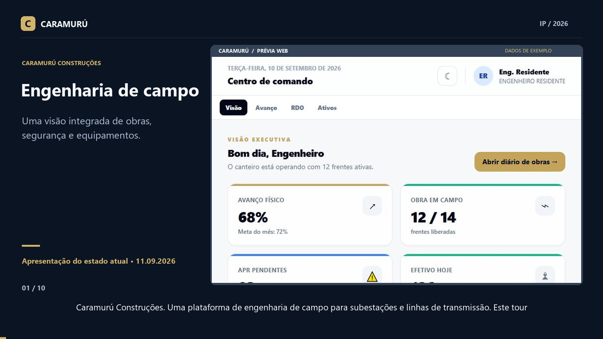

# Caramurú Construções

**Plataforma de engenharia de campo para subestações e linhas de transmissão.**

Gestão de obras, segurança do trabalho, equipamentos e evidências em uma base
compartilhada entre escritório e canteiro, com aplicativo móvel orientado ao uso offline.

**Estado em 11 de setembro de 2026:** interface Web navegável com dados demonstrativos;
backend e aplicativo móvel implementados parcialmente, com integrações e validações
de ponta a ponta ainda pendentes. O projeto está em desenvolvimento.

[Assistir à apresentação do estado atual — MP4](docs/media/caramuru-apresentacao.mp4)

**Duração:** 3 min 31 s · **Formato:** 1600 × 900, 24 fps · **Áudio:** português do Brasil.
[Legendas em português — SRT](docs/media/caramuru-apresentacao.srt)

O vídeo utiliza capturas reais da interface atual, narração em português e explicações
sobre os limites de cada demonstração. As telas apresentadas são do cliente Web;
o aplicativo nativo não foi executado nesta apresentação.

| Tempo | Conteúdo do vídeo |
| --- | --- |
| 00:00 | Apresentação da plataforma |
| 00:20 | Visão executiva |
| 00:42 | Tema escuro |
| 00:59 | Avanço físico e traçado |
| 01:20 | Filtro por Comissionamento |
| 01:39 | Diário de obras |
| 02:00 | Aprovação demonstrativa |
| 02:23 | Ativos e etiquetas |
| 02:41 | Ajuste da quantidade de etiquetas |
| 03:02 | Estado atual e próximas entregas |

## Visão do produto

A plataforma reúne quatro áreas de acompanhamento para a gestão de campo:

- **Visão executiva:** indicadores de produção, frentes, segurança e efetivo.
- **Avanço físico:** estruturas e fases construtivas de subestações e linhas de transmissão.
- **Diário de obras:** apresentação de APRs, condições do canteiro e evidências.
- **Ativos:** identificação de curvadoras hidráulicas, guinchos e andaimes.

Os papéis de domínio previstos são Diretor, Engenheiro Residente, TST, Encarregado e Fiscal.

## Interface Web

| Área | Comportamento disponível | Limitação atual |
| --- | --- | --- |
| Visão geral | Cartões de indicadores, barras por fase e atalhos para o diário | Números, horários e registros definidos no código |
| Aparência | Temas claro e escuro; navegação adaptada à largura da tela | Preferência de tema mantida durante a sessão do componente |
| Avanço físico | Conjunto demonstrativo de 80 torres e filtro por fase | Tabela exibe até 18 linhas por filtro, sem paginação |
| Mapa operacional | Representação de traçado, torres e subestações; zoom e alternância de camadas | Desenho em SVG, sem consulta ao PostGIS ou integração efetiva com MapLibre |
| Diário de obras | Cartões de clima, efetivo, APRs e evidências com coordenadas | Sem feed em tempo real; imagens são representações provisórias |
| Aprovação de frentes | Botão altera o status para “Aprovada agora” | Alteração apenas em memória React; sem gravação ou auditoria no backend |
| Rejeição e exportação | Botões presentes na interface | Ações ainda não implementadas |
| Etiquetas | Lotes de 1 a 48 unidades, identificação sequencial e acionamento da impressão do navegador | Padrões gráficos ainda não são QR Codes válidos; composição física de impressão não homologada |
| Permissões | Exibição de opções conforme papel configurado | Controle Web demonstrativo; autenticação e autorização por rota ainda incompletas |

As fases apresentadas são **Sondagem → Fundação / Concretagem → Içamento →
Encordoamento → Comissionamento**.

Expressões da interface como “Ao vivo”, “Sincronizado”, “WebP verificado” e “QR ativo”
integram os dados demonstrativos. Elas ainda não representam verificações reais
executadas pelo dashboard.

## Backend

O código da API contempla:

- Entidades de empresas, usuários, projetos e equipamentos, com geometria geográfica.
- Validação de JWT e identificação da empresa por requisição.
- Políticas de isolamento por empresa no PostgreSQL e controle de acesso por papel.
- Sincronização incremental de projetos, ativos, inspeções e APRs.
- Recibos persistidos de lotes, versões por campo e tratamento de conflitos.
- Registros de APR e Permissão de Trabalho, checklists de EPI/EPC e assinaturas.
- Regras de liberação associadas aos cenários identificados no código como NR-10 e NR-35.
- Upload retomável de imagens WebP, acompanhamento de offset e validação de hash,
  com destino em armazenamento compatível com S3/MinIO.

| Família de rotas | Finalidade |
| --- | --- |
| `/health` | Disponibilidade da aplicação |
| `/api/v1/sync` | Pull e push da sincronização |
| `/api/v1/safety` | APRs, permissões de trabalho e liberação |
| `/api/v1/uploads` | Sessões e transferência de evidências |
| `/docs` | Documentação HTTP interativa |

O mecanismo de upload é próprio, inspirado em transferência por offset; não há
declaração de compatibilidade integral com o protocolo TUS.
Login e ciclo completo de emissão, renovação e revogação de tokens ainda estão pendentes.
As regras de segurança implementadas não constituem homologação normativa do produto.

[Descrição da API](apps/api/README.md) · [Contrato OpenAPI versionado](packages/contracts/openapi.json)

## Aplicativo móvel

O cliente Expo/React Native possui código para:

- Persistência WatermelonDB sobre SQLite, com adapter configurado para JSI.
- Tabelas locais de projetos, ativos, inspeções, APRs, fotos, fila de mutações e estado de sincronização.
- Armazenamento de credenciais com Expo SecureStore.
- Detecção de conectividade com NetInfo e tentativa de sincronização após reconexão.
- Indicadores de estado e quantidade de registros pendentes.
- Leitura de QR Code com Expo Camera.
- Fluxo de checklist de EPI/EPC e coleta de assinatura na tela.
- Captura de evidência pela câmera, sem seleção pela galeria nesse fluxo.
- Coleta de coordenadas, precisão e timestamp retornados pelo provedor de localização.
- Composição visual de carimbo, conversão para WebP, hash e fila local de upload.

**Validação nativa pendente:** SQLite/JSI, câmera, permissões, persistência após reinício,
qualidade das imagens e sincronização completa precisam ser confirmados em aparelho.
O uso de JSI depende de uma compilação nativa; não é compatível com Expo Go.
O timestamp do provedor de localização não comprova, por si só, origem GNSS exclusiva.
A compressão atual não garante tamanho final de 600 KB ou preservação da nitidez técnica.

## Organização técnica

| Diretório | Responsabilidade | Tecnologias principais |
| --- | --- | --- |
| `apps/web` | Interface de gestão | Next.js 15, React 19, TypeScript, TailwindCSS |
| `apps/mobile` | Operação de campo | Expo SDK 52, React Native, WatermelonDB |
| `apps/api` | Serviços e persistência central | FastAPI, Python 3.12, SQLAlchemy, Alembic |
| `packages/contracts` | Contrato HTTP e tipos compartilhados | OpenAPI, TypeScript |
| `infra` | Recursos de infraestrutura | PostgreSQL/PostGIS |
| `docker-compose.yml` | Definição dos serviços locais | PostgreSQL 16/PostGIS, Redis 7, MinIO |

O monorepositório utiliza pnpm workspaces e Turborepo. Os componentes visuais Web
são componentes locais; uma integração formal com a biblioteca Shadcn/UI ainda não foi concluída.

## Verificação desta versão

Em 11/09/2026, a aplicação Web iniciou localmente, compilou a página principal e respondeu
com HTTP 200. A apresentação registrou a navegação entre módulos, alternância de tema,
filtro por Comissionamento, aprovação visual de uma APR e alteração do lote de 12 para 6 etiquetas.

Existem testes de contrato e sincronização na API e testes de persistência no cliente móvel.
Essas suítes não foram reexecutadas para a produção desta documentação e do vídeo.
Esta verificação visual não equivale à aprovação dos fluxos em produção.

## Próximas entregas do produto

- Integração do dashboard com APIs autenticadas e dados persistidos.
- Autenticação Web e autorização efetiva nas rotas e operações.
- Mapa geográfico conectado ao PostGIS.
- Aprovação e rejeição auditáveis, com atualização consistente dos indicadores.
- QR Codes válidos e etiquetas com dimensões de impressão verificadas.
- Exportação de RDO, relatórios técnicos e laudos.
- Validação do aplicativo em dispositivo e do fluxo completo de evidências offline.

## Autoria e licença

**IP — BezerraDevBack.**

Distribuído sob a [licença MIT](LICENSE).
